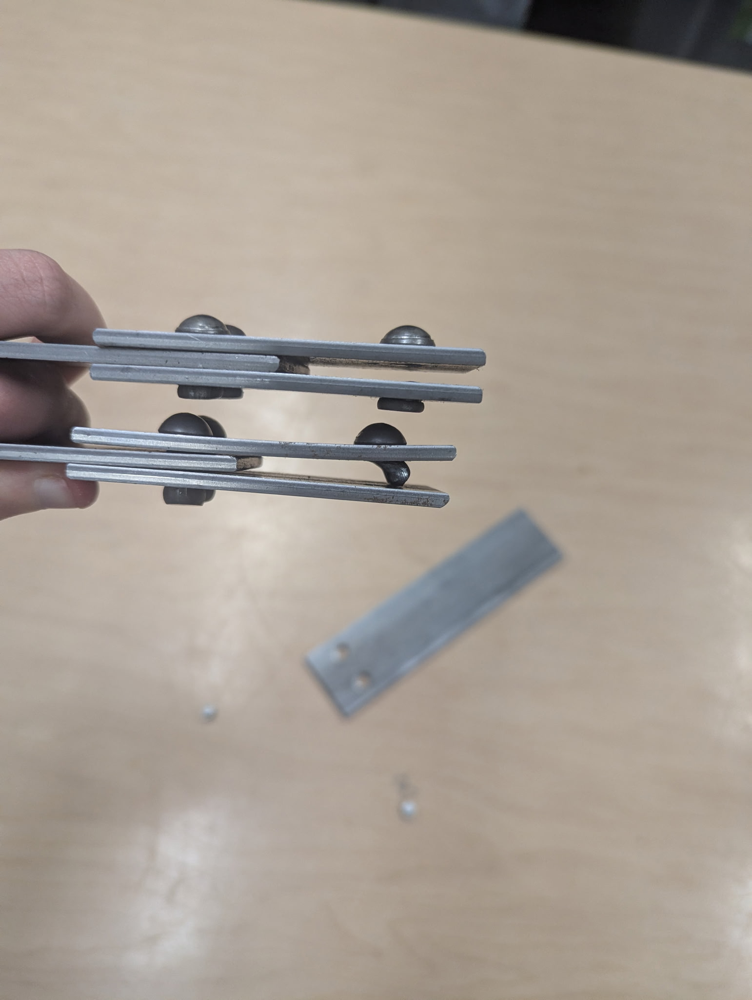

# Riveted Steel Joint Tensile Test



## Project Overview

This project investigated the tensile strength and failure behavior of riveted steel joints. Two joint configurations—a **lap splice** and a **butt splice**—were loaded in tension until failure.

The purpose of the experiment was to compare the strength of each joint, observe its physical failure mode, and evaluate how rivet shear, plate deformation, and joint geometry affected the overall load-carrying capacity.

## Objectives

* Examine the behavior of riveted steel joints under tensile loading.
* Compare the maximum load supported by lap-splice and butt-splice configurations.
* Identify the primary failure mode of each specimen.
* Relate the observed failures to concepts including shear stress, bearing stress, tensile stress, and plate bending.
* Evaluate how joint geometry influences structural performance.

## Joint Configurations

### Lap Splice

The lap-splice specimen consisted of two steel plates overlapping one another and connected by rivets. Because the plates were offset, the tensile load did not act through a single central plane. This created eccentric loading in addition to the direct tensile force.

### Butt Splice

The butt-splice specimen consisted of two steel plates positioned end-to-end and connected using splice plates and rivets. This configuration provided a more direct load path and used additional riveted connections to transfer the tensile load between the plates.

## Testing Procedure

1. The dimensions and construction of each specimen were inspected before testing.
2. Each riveted joint was secured in a tensile testing machine.
3. Tensile load was applied gradually to the specimen.
4. The specimen was observed for deformation, rivet movement, plate bending, and other signs of failure.
5. Loading continued until the joint could no longer support an increasing force.
6. The maximum applied load and final failure mode were recorded.
7. The performances of the two joint configurations were compared.

## Experimental Results

| Joint Configuration | Maximum Load | Primary Failure Mode           |
| ------------------- | -----------: | ------------------------------ |
| Lap splice          |     3,500 lb | Rivet shear                    |
| Butt splice         |     6,800 lb | Rivet shear with plate bending |

The butt-splice specimen supported approximately **94% more load** than the lap-splice specimen.

## Failure Analysis

### Lap-Splice Failure

The lap splice failed at an applied tensile load of approximately **3,500 lb**.

The primary failure mechanism was **rivet shear**. As the tensile force increased, the connected plates attempted to slide in opposite directions. This placed the rivets in shear until they could no longer transfer the applied load between the plates.

The offset arrangement of the overlapping plates also created eccentric loading. Because the applied force did not pass directly through the centerline of the connection, the specimen experienced additional rotation and bending. This likely contributed to uneven load distribution between the rivets and reduced the overall strength of the joint.

### Butt-Splice Failure

The butt splice failed at an applied tensile load of approximately **6,800 lb**.

The specimen exhibited a combination of **rivet shear and plate bending**. The rivets transferred the tensile force through the splice plates until the increasing load produced permanent deformation and eventual joint failure.

Compared with the lap splice, the butt-splice configuration provided a more direct and balanced load path. Its geometry and greater number of connected surfaces allowed the load to be distributed more effectively, resulting in a significantly higher failure load.

## Engineering Concepts

### Rivet Shear

Rivets transfer force between connected plates. When the plates attempt to slide relative to one another, the rivets resist the movement through shear.

Average rivet shear stress can be estimated using:

```text
τ = P / (nA)
```

where:

* `τ` = average shear stress in the rivets
* `P` = applied load
* `n` = number of rivet shear planes resisting the load
* `A` = cross-sectional area of one rivet

For a circular rivet:

```text
A = πd² / 4
```

where `d` is the rivet diameter.

### Bearing Stress

Bearing stress develops where each rivet presses against the wall of the hole in the steel plate.

Average bearing stress can be estimated using:

```text
σb = P / (ntd)
```

where:

* `σb` = average bearing stress
* `P` = applied load
* `n` = number of rivets carrying the load
* `t` = plate thickness
* `d` = rivet diameter

### Net-Section Tension

The rivet holes reduce the effective cross-sectional area of the steel plate. If the remaining material becomes overstressed, the plate may fracture across the line of holes.

Net tensile stress can be estimated using:

```text
σt = P / A_net
```

where:

* `σt` = tensile stress across the reduced section
* `P` = applied tensile load
* `A_net` = remaining cross-sectional area after accounting for the rivet holes

### Eccentric Loading

In a lap joint, the connected plates do not lie in the same plane. This offset creates a moment that can rotate or bend the connection as it is loaded.

This additional deformation can prevent the rivets from sharing the load evenly and may cause the connection to fail at a lower tensile force.

## Comparison of Joint Performance

The butt splice supported substantially more load than the lap splice. Several factors may have contributed to this result:

* The butt splice provided a straighter and more symmetrical load path.
* The connection distributed the applied force across more riveted interfaces.
* The lap splice experienced eccentric loading because its plates were offset.
* Rotation and bending in the lap splice may have caused uneven rivet loading.
* The butt splice resisted a greater load before rivet shear and plate deformation became critical.

The results demonstrate that joint strength depends not only on the strength of the rivets and steel plates but also on the geometry and load path of the entire connection.

## Key Findings

* The lap splice failed by rivet shear at approximately **3,500 lb**.
* The butt splice failed through rivet shear and plate bending at approximately **6,800 lb**.
* The butt splice supported approximately **1.94 times** the load carried by the lap splice.
* Eccentric loading likely reduced the effectiveness of the lap-splice connection.
* A more symmetrical joint configuration produced better load distribution and greater tensile strength.
* Observed physical failure may involve several interacting mechanisms rather than a single idealized stress condition.

## Conclusion

The tensile test demonstrated that the butt-splice configuration was stronger than the lap-splice configuration under the tested conditions.

Although both specimens experienced rivet shear, the butt splice supported nearly twice the applied load before failure. Its more balanced geometry and direct load path allowed it to distribute the tensile force more effectively. In contrast, the lap splice was affected by eccentric loading, rotation, and bending in addition to direct rivet shear.

This experiment highlighted the importance of connection geometry, rivet arrangement, material deformation, and load distribution when designing riveted structural joints.


## Tools and Skills Demonstrated

* Tensile testing
* Structural joint analysis
* Experimental data collection
* Failure-mode identification
* Shear-stress calculations
* Bearing-stress analysis
* Technical report writing
* Engineering comparison and interpretation

## Project Information

* **Course:** Mechanics of Solids
* **Institution:** Mercer County Community College
* **Semester:** Fall 2025
* **Author:** Andrew Dolci
* **Testing Equipment:** Tensile Testing Machine
